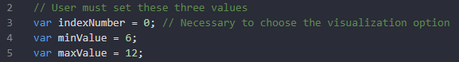
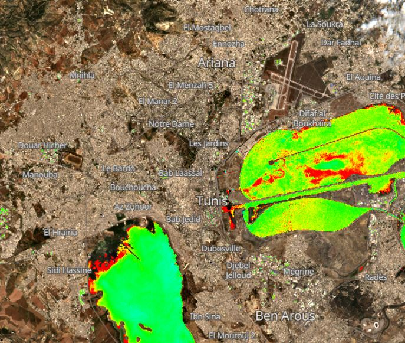
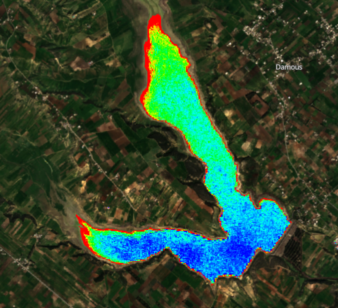
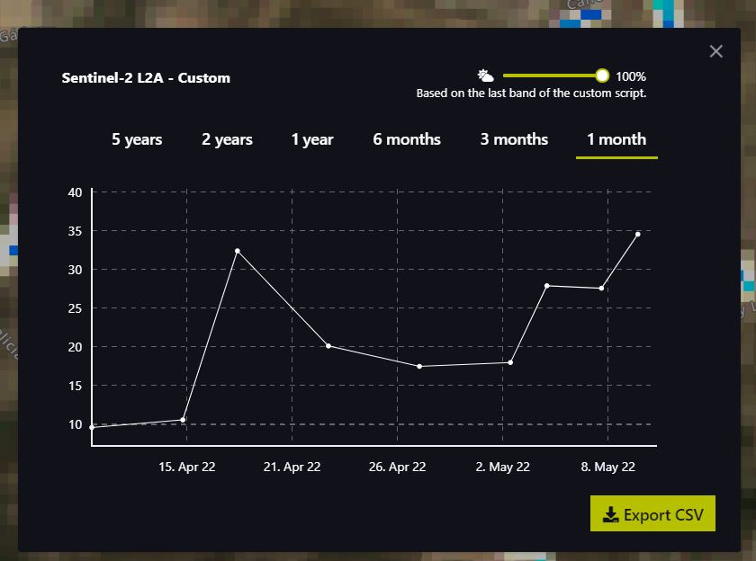
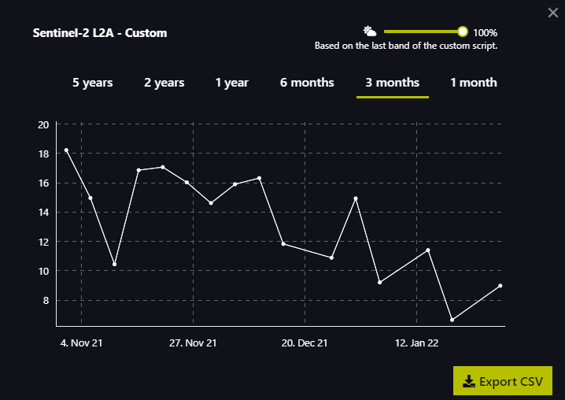
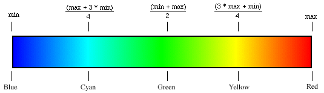
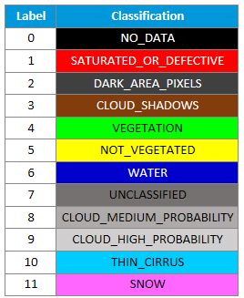
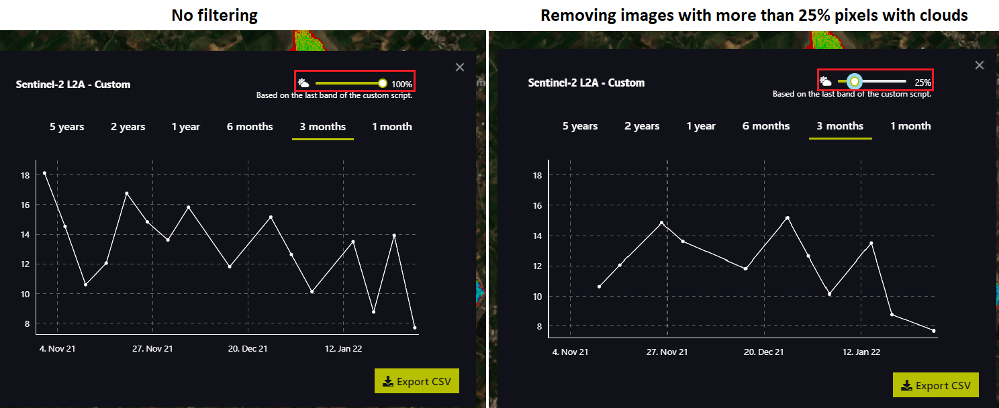
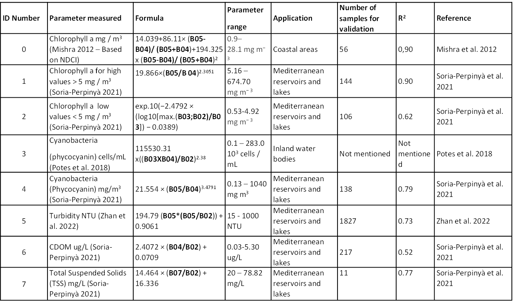

# **Description générale**
L'outil de surveillance de la qualité de l'eau MAGO est un code permettant d'estimer les paramètres de qualité de l'eau dans les lacs, les réservoirs ou les grands étangs à partir d'images Sentinel-2. L'utilisateur peut visualiser les paramètres de qualité de l'eau (chlorophylle-a, cyanotoxines, turbidité...) sur la carte EO Browser et obtenir les séries temporelles correspondantes aux points ou zones sélectionnés. Vous pouvez avoir plus d'informations et accéder au navigateur EO à ce lien : https://www.sentinel-hub.com/explore/eobrowser/

## Visuels
Voici l'affichage qui peut être obtenu pour la concentration de chlorophylle-a pour la journée 2022-01-30 au Barrage Lebna (Tunisie)
- Paramétrage des variables :
        <p align="center">
                
        </p>
- Visualisation de la carte
        <!--  -->
        <p align="center">
                
        </p>

- Tracé de série temporelles
        <!--  -->
        <p align="center">
                
        </p>

## Description du script

Les lignes suivantes décriront les aspects pertinents du code **MAGO Water Quality Monitoring Tool**.

### index Number (selection de la variable à visualiser)

L'utilisateur choisit l'un des indicateurs à visualiser (chaque indicateur a un numéro d'identification). Les indicateurs sont décrits dans la section Contexte scientifique ci-dessous. Pour effectuer cette sélection, l'utilisateur doit modifier la valeur de la variable suivante :

```
var indexNumber = 0;
```

### Color scale (échelle de couleurs)

<span dir="">En modifiant les valeurs min/max du script, il est possible d'ajuster les seuils numériques pour adapter la visualisation aux conditions actuelles.</span> Seules les deux lignes suivantes doivent être modifiées :

```
var minValue = 0; 
var maxValue = 30;
```

<span dir="">Plus en détail</span>:

* **<span dir="">minValue</span>** : <span dir="">diminuez cette valeur pour plus de sensibilité aux faibles concentrations de l'indice sélectionné.</span>
* **<span dir="">maxValue</span>**<span dir=""> : augmentez cette valeur pour une plus grande sensibilité aux concentrations élevées de l'indice sélectionné.</span>
        <p align="center">
                
        </p>

```
var scaleLimits = [minValue, (maxValue + 3*minValue)/4, (maxValue + minValue)/2, (3*maxValue + minValue)/4, maxValue]
var s = 255; // Les valeurs vont de 0 à 255 pour chaque canal de couleur
var colorScale =  // Définit les couleurs RGB pour chaque transition de couleur
  [
   [0/s, 0/s, 255/s], // Blue
   [0/s, 255/s, 255/s], // Cyan
   [0/s, 255/s, 0/s], // Green
   [255/s, 255/s, 0/s], // Yellow
   [255/s, 0/s, 0/s], // Red
  ];
```

### Pixel filtering (Filtrage des pixels)

#### Filter by NDWI (Filtrer par NDWI)

Nous avons fait un premier filtre par **NDWI** (<span dir="">Normalized Difference Water Index</span>) afin de différencier les pixels avec de l'eau de ceux sans. <span dir="">Si le NDWI est inférieur à 0, ce n'est pas de l'eau, donc tous les pixels identifiés comme "pas d'eau" seront affichés en vraie couleur.</span>

```
if (NDWI < -0) { // If NDWI is lower than 0 is not water, so return  true color
  imgVals = [...TrueColor, samples.dataMask];
```

#### Filter by clouds and other elements (Filtrer les nuages et autres éléments)

Le but est de pouvoir faire un filtrage ultérieur en supprimant les pixels contenant des nuages et d'autres éléments, comme la neige. Ceci est réalisé par la fonction suivante qui utilise les résultats SCL :

```
function isCloud(scl)
```


<span dir="">Scene Classification Map (SCL) vise à fournir une carte de classification des pixels, avec des valeurs de 0 à 11. Les étiquettes peuvent être vues dans le tableau ci-dessous.</span>
        <p align="center">
                
        </p>
<span dir="">Sur la base de cette classification, la fonction évaluera chaque pixel et renverra vrai pour les étiquettes 1, 3, 8, 9, 10 et 11.</span> <span dir="">Cela permettra< /span>w images avec un pourcentage élevé de pixels considérés comme troubles ou défectueux à ignorer dans l'affichage du tracé de la série temporelle.
        <p align="center">
                
        </p>
        
## Contexte scientifique
### Introduction

<span dir="">La surveillance de la qualité de l'eau par satellite est appliquée depuis de nombreuses années et est soutenue par les différentes absorptions et réflexions de la lumière solaire par les composants de l'eau. Par exemple, le pigment d'algue chlorophylle-a reflète la bande spectrale verte (entre 530 et 590 nm) mais absorbe la bande rouge (entre 640 et 670 nm).</span>

Sentinel 2 offre une plus grande fréquence de mesure que les missions satellites précédentes fournissant une analyse régulière tous les 5 jours. Il est équipé d'un instrument multispectral (MSI) fournissant des images haute résolution qui permettent de mesurer les réflexions de la Terre sur 13 bandes spectrales différentes, dont le proche infrarouge (NIR) et l'infrarouge à ondes courtes (SWIR).

### Description des paramètres de qualité de l'eau calculés

L'outil de surveillance de la qualité de l'eau MAGO vise à intégrer différents paramètres de qualité de l'eau calculés à l'aide des formules répertoriées dans le tableau ci-dessous - répertoriés par **numéro d'index** de 0 à 7.
        <p align="center">
                
        </p>
Pour l'index avec le numéro d'identification 3, la formule indiquée dans le tableau n'est pas correcte. La formule correcte serait égale à "1000 x 115530.31 x ((B03xB04)/B02)^2.38" donc dans ce cas les unités sont des cellules/mL.

L'outil de surveillance de la qualité de l'eau MAGO était axé sur l'analyse de la chlorophylle-a et des cyanobactéries, ainsi que sur certains paramètres physicochimiques. Une brève explication des algorithmes sélectionnés est la suivante :

<détails>
<summary>Chlorophylle-a</summary>
Pour la mesure de ce paramètre dans l'outil MAGO, nous avons sélectionné trois formules différentes.

**NDCI développé par Mishra et al. 2012 et adapté au satellite S2-MSI** est l'un des indices les plus couramment utilisés. Bien qu'il ait été développé pour les zones côtières, son application à d'autres masses d'eau a été réalisée avec succès.

**Chlorophylle-a hautes valeurs (Soria-Perpinyà 2021)** cette formule a été optimisée pour son application aux masses d'eau intérieures de la zone méditerranéenne, elle peut donc être plus spécifique pour ce type d'eau que le NDCI.

**De faibles valeurs de chlorophylle-a également optimisées par Soria-Perpinyà 2021** ont été appliquées dans les eaux intérieures méditerranéennes avec de faibles concentrations de Chl-a qui peuvent être plus difficiles à détecter, elles sont donc applicables dans les situations où de faibles concentrations de Chl -a sont attendus.

</détails>

<détails>
<summary>Paramètres physicochimiques</summary>
 Trois paramètres physicochimiques ont été inclus dans l'outil de surveillance de la qualité de l'eau MAGO, tels que la turbidité, la matière organique dissoute colorée (cDOM) et le total des solides en suspension (TSS). Ces paramètres ont été sélectionnés car ils sont parmi les plus pertinents pour la surveillance de la qualité de l'eau et elles peuvent être mesurées par analyse satellitaire. Les formules incluses dans l'outil MAGO ont été sélectionnées sur la base des critères suivants : Elles ont été développées pour les masses d'eau intérieures, spécifiquement pour la zone méditerranéenne. Elles ont été validées par comparaison entre les données satellitaires et in situ. Les données satellitaires ont fourni une bonne corrélation avec les mesures in situ.
</détails>

### Limites

<div>

L'estimation par satellite des paramètres de l'eau dépend de la réflectance de la lumière solaire par les composants de l'eau.

Celui-ci souffre de plusieurs limitations :

- la lumière du soleil n'est réfléchie que par la **couche d'eau supérieure** (par exemple, les premiers 50 cm), de sorte qu'aucune information n'est fournie sur la couche inférieure (cela a une certaine importance dans le cas d'eau stratifiée ou d'éléments en mouvement tels que certaines cyanobactéries) ; certaines recherches sont en cours de développement pour obtenir plus d'informations plus profondément dans la colonne d'eau, mais aucune avancée opérationnelle n'est attendue dans les prochaines années.
- la réflectance peut être influencée par la **composition atmosphérique** (e.g. vapeur d'eau, aérosol...) - certaines corrections sont appliquées dans les données brutes mais la correction standard utilisée pour les données Sentinel (Sen2Cor) n'est pas optimale pour les surfaces d'eau (qui ne reflètent que très peu de lumière solaire) - cela peut entraîner des erreurs de mesure et introduire des valeurs aberrantes dans l'analyse des séries chronologiques (même si un filtre nuage est appliqué) ; différentes corrections atmosphériques alternatives plus adaptées aux surfaces d'eau sont déjà disponibles (mais elles ne sont pas encore utilisées dans des plateformes telles que le Sentinel Hub EO Browser).
- les mesures sont prises à des **heures précises** (par exemple 11h), constantes pour un satellite et une région - cela peut être important pour certaines variables qui peuvent varier au cours de la journée ; l'heure exacte des images satellites peut être vérifiée dans la plate-forme telle que le navigateur Sentinel Hub EO)
- évidemment la réflectance est influencée par la **composition de l'eau** et s'il y a un mélange de composants, cela rend difficile l'estimation de chacun d'eux ; un exemple pourrait être une eau très boueuse (haute turbidité) avec également une forte teneur en algues (haute teneur en chlorophylle-a).


## Utilisation des scripts précédents
Le script lui-même a été écrit en Java Script en utilisant comme base d'autres scripts ouverts tels que :
- Ulyssys Water Quality Viewer (UWQV) disponible sur https://custom-scripts.sentinel-hub.com/sentinel-2/ulyssys_water_quality_viewer/
- Se2WaQ - Script de qualité de l'eau Sentinel-2 disponible sur https://custom-scripts.sentinel-hub.com/sentinel-2/se2waq/
- Code de modèle d'indice de végétation à différence normalisée disponible sur https://custom-scripts.sentinel-hub.com/custom-scripts/sentinel-2/ndvi/

## Références scientifiques

- Mishra, S., Mishra, D.R., 2012. Normalized difference chlorophyll index: A novel model for remote estimation of chlorophyll-a concentration in turbid productive waters. Remote Sens. Environ. 117, 394–406. https://doi.org/10.1016/j.rse.2011.10.016

- Potes, M., Rodrigues, G., Marchã Penha, A., Helena Novais, M., João Costa, M., Salgado, R., Manuela Morais, M., 2018. Use of Sentinel 2-MSI for water quality monitoring at Alqueva reservoir, Portugal. Proc. Int. Assoc. Hydrol. Sci. 380, 73–79. https://doi.org/10.5194/piahs-380-73-2018

- Sòria-Perpinyà, X., Vicente, E., Urrego, P., Pereira-Sandoval, M., Tenjo, C., Ruíz-Verdú, A., Delegido, J., Soria, J.M., Peña, R., Moreno, J., 2021. Validation of water quality monitoring algorithms for sentinel-2 and sentinel-3 in mediterranean inland waters with in situ reflectance data. Water (Switzerland) 13. https://doi.org/10.3390/w13050686

- Zhan, Y., Delegido, J., Erena, M., Soria, J.M., Ruiz-Verdú, A., Urrego, P., Sòria-Perpinyà, X., Vicente, E., Moreno, J., 2022. Mar Menor lagoon (SE Spain) chlorophyll-a and turbidity estimation with Sentinel-2. Limnetica 41, 1. https://doi.org/10.23818/limn.41.18

## Reconnaissance
Ce projet fait partie du programme PRIMA soutenu par l'Union Européenne


## Licence
Ce travail est sous licence CC BY-SA 4.0 https://creativecommons.org/licenses/by-sa/4.0/
Si nécessaire, veuillez citer comme « Outil de surveillance de la qualité de l'eau MAGO, code ouvert pour le navigateur EO développé dans le cadre du projet PRIMA MAGO par CETAQUA »


